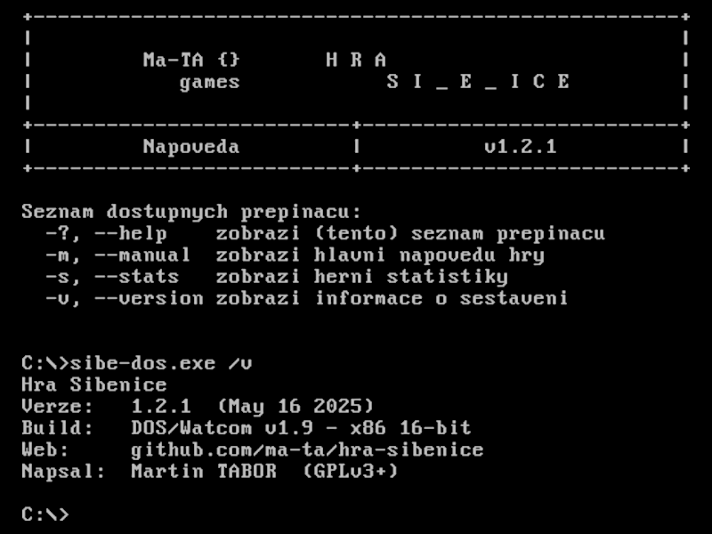

# Hra Š I _ E _ I C E

> Multiplatformní implementace známé slovní hry Šibenice pro terminál

### Binárky ke stažení

- **⬇️&nbsp;[Stáhnout instalátor pro Windows&nbsp;🪟](//github.com/ma-ta/hra-sibenice/releases/download/v1.2.0/sibenice-setupwin.exe)**
- ⬇️&nbsp;Stáhnout All-in-1 balíček (všechny binárky): 
  [TAR.GZ](//github.com/ma-ta/hra-sibenice/releases/download/v1.2.0/sibenice-bin.tar.gz)&nbsp;📦, 
  [ZIP](//github.com/ma-ta/hra-sibenice/releases/download/v1.2.0/sibenice-bin.zip)&nbsp;📦 
  (rozbalte stažený archiv a zvolte spustitelný [soubor](https://github.com/ma-ta/hra-sibenice/blob/v1.2.0/bin/#readme) dle vaší platformy):

| Platforma       | 💽 | x86-64          | x86 32-bit | x86 16-bit | ARM64 (AArch64) | ARM 32-bit (armhf) | RISC-V (riscv64) | WebAssembly (wasm32)
|-----------------|----|-----------------|---------------|---------------|--------------------|-----------------------|---------------------|--------------------------
| 🪟&nbsp;Windows | 🆕 | 🆕             | 🆕            |               | 🆕                 |                       |                     |
| 🐧&nbsp;Linux   |    | 🆕              | 🆕           |               | 🆕                 | 🆕&nbsp;☢️           | 🆕&nbsp;☢️          |
| 🍎&nbsp;macOS   |    | ✅&nbsp;v1.1.0  |               |               | ✅&nbsp;v1.1.0    |                       |                     |
| 😈&nbsp;FreeBSD |    | 🆕              |               |               | 🆕&nbsp;☢️        |                       |                     |
| 💾&nbsp;DOS     |    |                 | 🆕            | 🆕&nbsp;☢️   |                    |                       |                     |
| 🌐&nbsp;Web     |    |                 |               |               |                    |                       |                     | 🆕&nbsp;☢️

> **Legenda:**  
🆕&nbsp;–&nbsp;aktuální sestavení: v1.2.0,  
✅&nbsp;–&nbsp;starší sestavení,  
☢️&nbsp;–&nbsp;nedostatečně otestovaná platforma,  
💽&nbsp;–&nbsp;dostupný user-friendly (🐤 BFU) instalátor ve složce [bin-setup](https://github.com/ma-ta/hra-sibenice/tree/v1.2.0/bin-setup).

**Další odkazy:**
- [Přehled verzí &amp; changelog](//github.com/ma-ta/hra-sibenice/releases)
- [Adresář s binárkami](https://github.com/ma-ta/hra-sibenice/tree/v1.2.0/bin)

### Popis a stručné instrukce
Známá slovní hra (alias Oběšenec, Hangman) založená na hádání jednotlivých písmen tajného slova.
Program je napsán v jazyce C a pro jeho spuštění by neměly být potřeba žádné nestandardní knihovny.

- **[Základní instrukce k sestavení](https://github.com/ma-ta/hra-sibenice/blob/v1.2.0/how_make.md)**
- [Nápověda ke hře](https://github.com/ma-ta/hra-sibenice/blob/v1.2.0/res/napoveda.md)
- [Známé chyby a nápady na další vývoj](https://github.com/ma-ta/hra-sibenice/blob/v1.2.0/res/poznamky.md)

#### Pozn. pro systémy typu 💾&nbsp;DOS
U 32-bit binárky v případě zobrazení hlášky *"Load error: no DPMI - Get csdpmi\*.zip"* umístěte soubor [CWSDPMI.EXE](/bin/CWSDPMI.EXE) do stejného adresáře jako spustitelný soubor hry. Více o problematice např. [zde](//en.wikipedia.org/wiki/CWSDPMI) nebo [zde](https://sandmann.dotster.com/cwsdpmi/).  
Nativní 16-bit verze běží samostatně.

#### Pozn. pro systém 🍎&nbsp;macOS
Stažené binární soubory nejsou podepsané, proto je pravděpodobně bude možné spustit až po odebrání příslušného příznaku. 
Např. příkazem: [xattr -d com.apple.quarantine sibenice-macUni].

#### Použité kompilátory *(platformy)*:
- UN*X:
  - 🐧&nbsp;Ubuntu 24.04.2 LTS *(GCC 13.3.0) &ndash; [x86] [x86-64] [AArch64] [armhf] [riscv64]*
  - 🍎&nbsp;macOS 15.4 *(Apple Clang 17.0.0) &ndash; [x86-64] [AArch64] [Universal]*
  - 😈&nbsp;FreeBSD 14.2 *(Clang 18.1.6) &ndash; [x86-64] [AArch64]*
- 🪟&nbsp;Win:
  - Windows 11 *(MSVC 19.43.34810) &ndash; [x86] [x86-64] [AArch64]*
- 💾&nbsp;DOS:
  - FreeDOS 1.4:
    - *(Open Watcom 1.9) &ndash; [x86 16-bit]*
    - *(DJGPP GCC 12.2.0) &ndash; [x86 32-bit]*
- 🌐&nbsp;Web:
  - Wasm *(Emscripten 4.0.8) &ndash; [wasm32]*

### Snímky obrazovky

[Všechny dostupné screenshoty zde](https://github.com/ma-ta/hra-sibenice/tree/v1.2.0/res/screenshots)

<figure>
  <figcaption>macOS 15.4 (Sequoia) Terminal:</figcaption>
  
</figure>

<figure>
  <figcaption>Webové rozhraní (Google Chrome 136):</figcaption>
  
</figure>

<figure>
  <figcaption>Informace o verzi (DOSBox-X 2025.02.01):</figcaption>
  
</figure>

<figure>
  <figcaption>Hlavní menu:</figcaption>
  
</figure>

<figure>
  <figcaption>Obrazovka hry:</figcaption>
  
</figure>

<figure>
  <figcaption>Herní statistiky:</figcaption>
  
</figure>

<figure>
  <figcaption>DOS&nbsp;&ndash;&nbsp;25&times;80 znaků:</figcaption>
  
</figure>
