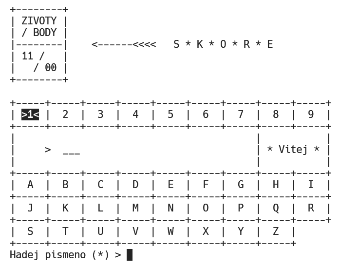

# Hra Š I _ E _ I C E

> Multiplatformní implementace známé slovní hry Šibenice pro terminál

### Binárky ke stažení

- **⬇️&nbsp;[Stáhnout instalátor pro Windows&nbsp;🪟](//github.com/ma-ta/hra-sibenice/releases/download/v1.2.0/sibenice-setupwin.exe)**
- ⬇️&nbsp;Stáhnout All-in-1 balíček (všechny binárky): 
  [TAR.GZ](//github.com/ma-ta/hra-sibenice/releases/download/v1.2.0/sibenice-bin.tar.gz)&nbsp;📦, 
  [ZIP](//github.com/ma-ta/hra-sibenice/releases/download/v1.2.0/sibenice-bin.zip)&nbsp;📦 
  (rozbalte stažený archiv a zvolte spustitelný [soubor](https://github.com/ma-ta/hra-sibenice/blob/v1.2.0/bin) dle vaší platformy):

| Platforma       | 💽 | x86_64       | AArch64       | x86 32-bit     | x86 16-bit  | Wasm
|-----------------|----|--------------|---------------|----------------|--------------|------------
| 🪟&nbsp;Windows | 🆕 | 🆕           | 🆕            | 🆕            | ❌          | &ndash;
| 🐧&nbsp;Linux   |    | 🆕           | 🆕            | 🆕            | ❌          | &ndash;
| 🍎&nbsp;macOS   |    | ✅           | ✅            | ❌            | ❌          | &ndash;
| 💾&nbsp;DOS     |    | ❌           | ❌            | ❌            | 🆕 ☢️       | &ndash;
| 🌐&nbsp;Web     |    | &ndash;      | &ndash;       | &ndash;        | &ndash;     | 🆕 ☢️

**Legenda:**
  - 🆕&nbsp;&ndash;&nbsp;nativní binárka (aktuální sestavení:&nbsp;**2025-04-28**),
  - ✅&nbsp;&ndash;&nbsp;nativní binárka (starší sestavení),
  - ☢️&nbsp;&ndash;&nbsp;nedostatečně otestovaná platforma,
  - 💽&nbsp;&ndash;&nbsp;dostupný user-friendly (🐤&nbsp;BFU) instalátor ve složce [bin-setup](https://github.com/ma-ta/hra-sibenice/tree/v1.2.0/bin-setup),
  - 🔥&nbsp;&ndash;&nbsp;ve vývoji,
  - ❌&nbsp;&ndash;&nbsp;nepodporovaná/neexistující/netestovaná platforma.

**Další odkazy:**
- [Přehled verzí &amp; changelog](//github.com/ma-ta/hra-sibenice/releases)
- [Adresář s binárkami](https://github.com/ma-ta/hra-sibenice/tree/v1.2.0/bin)

### Popis a stručné instrukce
Známá slovní hra (alias Oběšenec, Hangman) založená na hádání jednotlivých písmen tajného slova.
Program je napsán v jazyce C a pro jeho spuštění by neměly být potřeba žádné nestandardní knihovny.

- **[Základní instrukce k sestavení](https://github.com/ma-ta/hra-sibenice/blob/v1.2.0/how_make.md)**
- [Nápověda ke hře](https://github.com/ma-ta/hra-sibenice/blob/v1.2.0/res/napoveda.md)
- [Známé chyby a nápady na další vývoj](https://github.com/ma-ta/hra-sibenice/blob/v1.2.0/res/poznamky.md)

#### Pozn. pro systémy typu 💾&nbsp;DOS
U 32-bit binárky v případě zobrazení hlášky *"Load error: no DPMI - Get csdpmi\*.zip"* umístěte soubor [CWSDPMI.EXE](/bin/CWSDPMI.EXE) do stejného adresáře jako spustitelný soubor hry. Více o problematice např. [zde](//en.wikipedia.org/wiki/CWSDPMI) nebo [zde](https://sandmann.dotster.com/cwsdpmi/).  
Nativní 16-bit verze běží samostatně.

#### Pozn. pro systém 🍎&nbsp;macOS
Stažené binární soubory nejsou podepsané, proto je pravděpodobně bude možné spustit až po odebrání příslušného příznaku. 
Např. příkazem: [xattr -d com.apple.quarantine sibenice-macUni].

#### Použité kompilátory *(platformy)*:
- UN*X:
  - 🐧&nbsp;Ubuntu 24.04.2 LTS *(GNU GCC 13.3.0) &ndash; [x86] [x86_64] [AArch64]*
  - 🍎&nbsp;macOS 15.4 *(Apple Clang 17.0.0) &ndash; [x86_64] [AArch64] [Universal]*
- 🪟&nbsp;Win:
  - Windows 11 *(MSVC 19.43.34810) &ndash; [x86] [x86_64] [AArch64]*
- 💾&nbsp;DOS:
  - FreeDOS 1.4:
    - *~~(DJGPP GCC 12.2.0) &ndash; [x86 32-bit]~~*&nbsp;&nbsp;❌&nbsp;(pouze do [v1.1.0](https://github.com/ma-ta/hra-sibenice/releases/tag/v1.1.0))
    - *(Open Watcom 1.9) &ndash; [x86 16-bit]*
- 🌐&nbsp;Web:
  - Wasm *(Emscripten 4.0.7) &ndash; [wasm-32]*

### Snímky obrazovky

- [Všechny dostupné screenshoty zde](https://github.com/ma-ta/hra-sibenice/tree/v1.2.0/res/screenshots)

macOS 15 (Sequoia):

Webové rozhraní:

Hlavní menu:

Obrazovka hry:

Herní statistiky:

Obrazovka hry (DOS – 25x80 znaků):

Informace o verzi (DOS):

