# Hra&nbsp;Š&nbsp;I&nbsp;\_&nbsp;E&nbsp;_&nbsp;I&nbsp;C&nbsp;E

> Multiplatformní implementace známé slovní hry Šibenice pro terminál

### Binárky ke stažení

- **⬇️&nbsp;[Stáhnout instalátor pro Windows&nbsp;🪟](//github.com/ma-ta/hra-sibenice/releases/download/v1.3.2/sibenice-setupwin.exe)**
- ⬇️&nbsp;Stáhnout All-in-1 balíček (všechny binárky): 
  [TAR.GZ](//github.com/ma-ta/hra-sibenice/releases/download/v1.3.2/sibenice-bin.tar.gz)&nbsp;📦, 
  [ZIP](//github.com/ma-ta/hra-sibenice/releases/download/v1.3.2/sibenice-bin.zip)&nbsp;📦&nbsp;&nbsp;|&nbsp;&nbsp;*[v1.1.0 pro macOS](https://github.com/ma-ta/hra-sibenice/releases/tag/v1.1.0)*&nbsp;🍎 
  (rozbalte stažený archiv a zvolte spustitelný [soubor](https://github.com/ma-ta/hra-sibenice/blob/v1.3.2/bin/#readme) dle vaší platformy):

| Platforma       | 💽 | x86-64          | x86 32-bit  | x86 16-bit      | ARM64 (AArch64) | ARM 32-bit (armhf) | RISC-V (riscv64) | Wasm (wasm32)
|-----------------|------------------------------------|-----------------|----------------|--------------------|--------------------|-----------------------|---------------------|--------------------------------------------------
| 🪟&nbsp;Windows | ✅                                 | ✅             | ✅             |                    | ✅️                 |                       |                     |
| 🍎&nbsp;macOS   |                                    | ☑️&nbsp;v1.1.0  |                |                    | ☑️&nbsp;v1.1.0     |                       |                     |
| 🐧&nbsp;Linux   |                                    | ✅              | ✅            |                    | ✅                 | ✅                   | ✅                  |
| 🤖&nbsp;Android |                                    |                 |                |                    | ✅                 |                       |                     |
| 😈&nbsp;FreeBSD |                                    | ☑️&nbsp;v1.3.1  | ☑️&nbsp;v1.3.1 |                    | ☑️&nbsp;v1.3.1    |                       |                     |
| 💾&nbsp;DOS     |                                    |                 | ☑️&nbsp;v1.3.1 | ✅️                 |                    |                       |                     |
| 🌐&nbsp;Web     |                                    |                 |                |                    |                    |                       |                     | ✅

> **Legenda:**  
✅&nbsp;–&nbsp;aktuální verze: **1.3.2**,  
☑️&nbsp;–&nbsp;starší verze,  
💽&nbsp;–&nbsp;dostupný user-friendly (🐤 BFU) instalátor ve složce [bin-setup](https://github.com/ma-ta/hra-sibenice/tree/v1.3.2/bin-setup).

**Další odkazy:**
- [Přehled verzí &amp; changelog](//github.com/ma-ta/hra-sibenice/releases)
- [Adresář s binárkami](https://github.com/ma-ta/hra-sibenice/tree/v1.3.2/bin)

### Popis a stručné instrukce
Známá <a title="Wikipedie" href="//cs.wikipedia.org/wiki/%C5%A0ibenice_(hra)">slovní hra</a> (alias Oběšenec, Kat, Hangman) založená na hádání jednotlivých písmen tajného slova.
Program je napsán v jazyce C a pro jeho spuštění či sestavení by neměly být potřeba žádné dodatečné komponenty.

- **[Základní instrukce k sestavení](https://github.com/ma-ta/hra-sibenice/blob/v1.3.2/how_make.md)**
- [Nápověda ke hře](https://github.com/ma-ta/hra-sibenice/blob/v1.3.2/res/napoveda.md)
- [Známé chyby a nápady na další vývoj](https://github.com/ma-ta/hra-sibenice/blob/v1.3.2/res/poznamky.md)

#### Pozn. pro systém 🍎&nbsp;macOS
Stažené binární soubory nejsou podepsané, proto je pravděpodobně bude možné spustit až po odebrání příslušného příznaku. 
Např. příkazem: [xattr -d com.apple.quarantine sibenice-macUni].

#### Pozn. pro systém 🤖&nbsp;Android
Hra byla sestavena a otestována v emulátoru terminálu [Termux](https://termux.dev/en/), který je možné
nainstalovat z [Google Play](https://play.google.com/store/apps/details?id=com.termux&hl=cs) nebo přes alternativní obchod [F-Droid](https://f-droid.org/en/packages/com.termux/).

#### Pozn. pro systémy typu 💾&nbsp;DOS
U 32-bit binárky v případě zobrazení hlášky *"Load error: no DPMI - Get csdpmi\*.zip"* umístěte soubor [CWSDPMI.EXE](/bin/CWSDPMI.EXE) do stejného adresáře jako spustitelný soubor hry. Více o problematice např. [zde](//en.wikipedia.org/wiki/CWSDPMI) nebo [zde](https://sandmann.dotster.com/cwsdpmi/).  
Nativní 16-bit verze běží samostatně.

#### Použité kompilátory *(platformy)*:
- UN*X:
  - 🐧&nbsp;(2026-02-18)&nbsp;&nbsp;Ubuntu 26.04 LTS *(GCC 15.2.0) &ndash; [x86] [x86-64] [AArch64] [armhf] [riscv64]*
  - 🍎&nbsp;macOS 15.4 *(Apple Clang 17.0.0) &ndash; [x86-64] [AArch64] [Universal]*
  - 😈&nbsp;FreeBSD 14.3 *(Clang 19.1.7) &ndash; [x86] [x86-64] [AArch64]*
  - 🤖&nbsp;(2026-01-07)&nbsp;&nbsp;Android 16/Termux 2026.01.07 *(Clang 21.1.8) &ndash; [AArch64]*
- 🪟&nbsp;Win:
  - (2026-02-18)&nbsp;&nbsp;Windows 11 25H2 *(MSVC 19.50.35724) &ndash; [x86] [x86-64] [AArch64]*
- 💾&nbsp;DOS:
  - FreeDOS 1.4:
    - (2026-01-07)&nbsp;&nbsp;*(Open Watcom 1.9) &ndash; [x86 16-bit]*
    - (2025-07-04)&nbsp;&nbsp;*(DJGPP GCC 12.2.0) &ndash; [x86 32-bit]*
- 🌐&nbsp;Web:
  - (2026-02-18)&nbsp;&nbsp;Wasm *(Emscripten 5.0.1) &ndash; [wasm32]*

### Snímky obrazovky

[Všechny dostupné screenshoty zde](https://github.com/ma-ta/hra-sibenice/tree/v1.3.2/res/screenshots)

<figure>
  <figcaption>macOS 15.4 (Sequoia) Terminal&nbsp;&ndash;&nbsp;obrazovka hry (v1.1.0):</figcaption>
  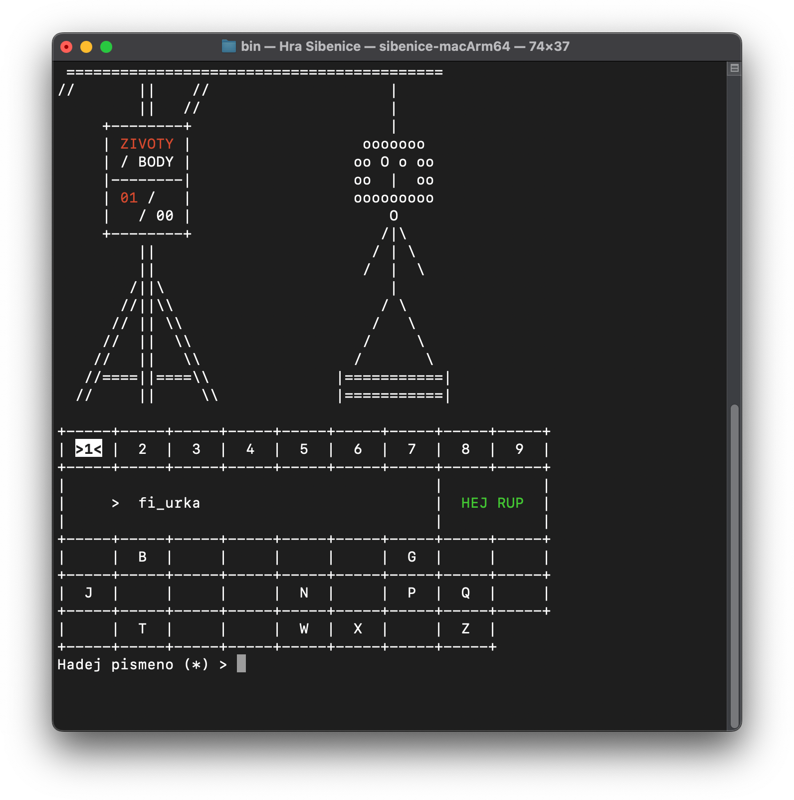
</figure>

<figure>
  <figcaption>Windows 11 (24H2)&nbsp;&ndash;&nbsp;obrazovka hry:</figcaption>
  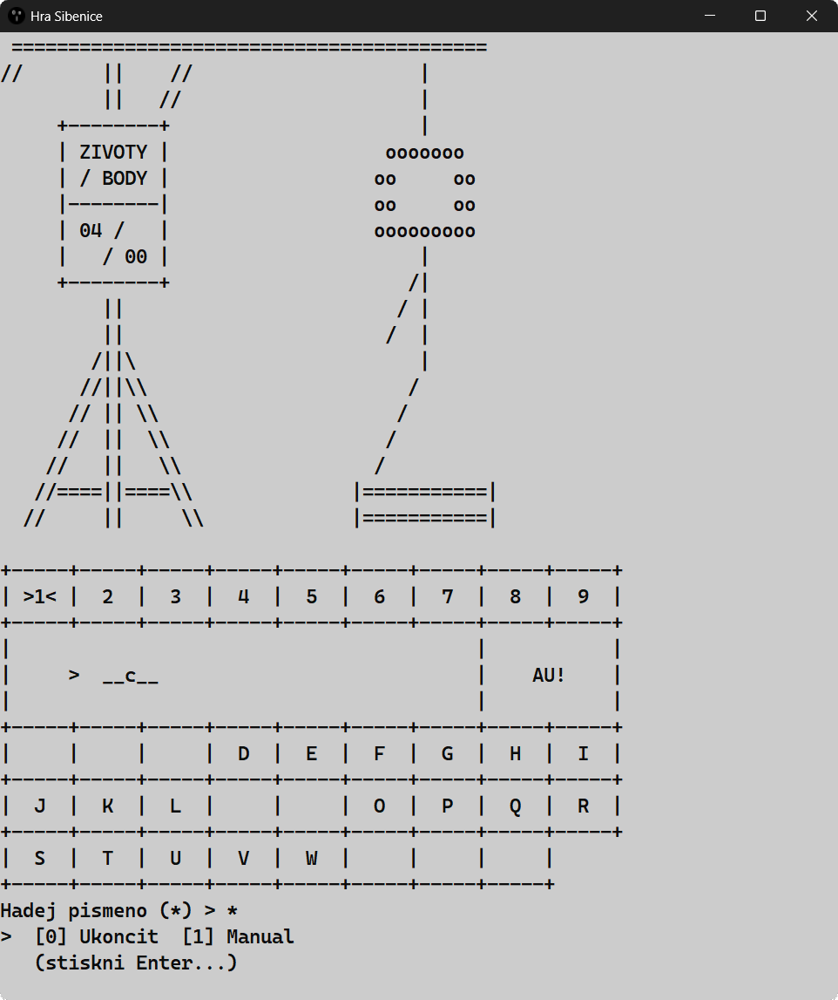
</figure>

<figure>
  <figcaption>Webové rozhraní (Google Chrome 143):</figcaption>
  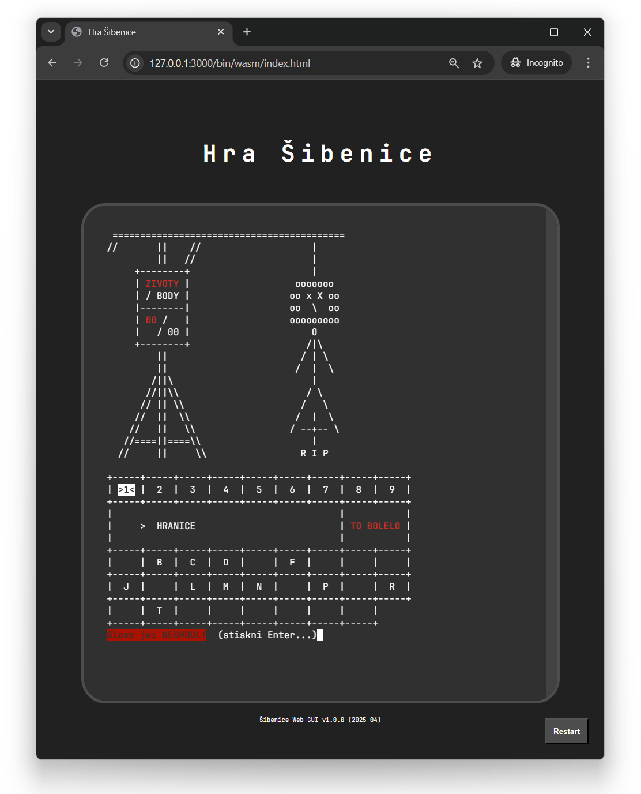
</figure>

<figure>
  <figcaption>Herní statistiky:</figcaption>
  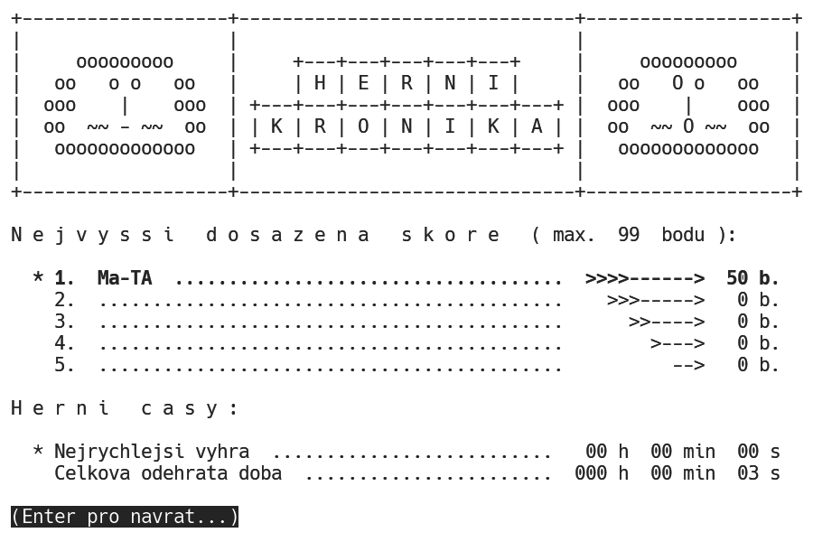
</figure>

<figure>
  <figcaption>Informace o verzi (DOSBox-X 2025.05.03):</figcaption>
  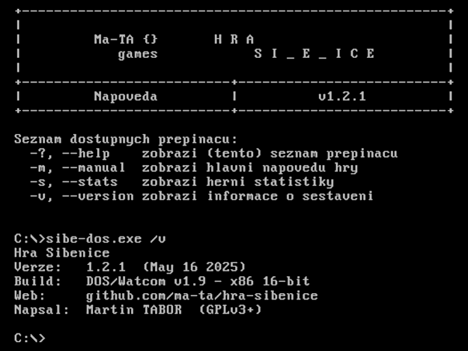
</figure>

<figure>
  <figcaption>MS-DOS&nbsp;&ndash;&nbsp;hlavní menu:</figcaption>
  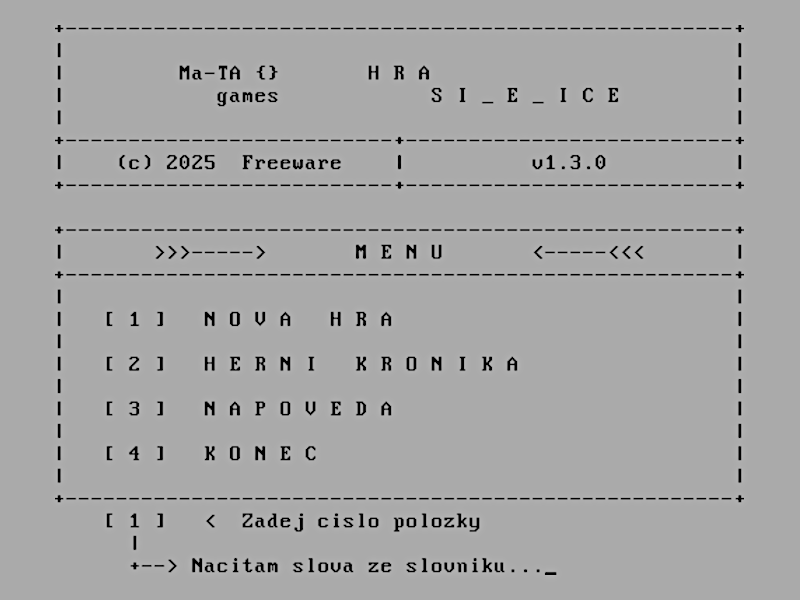
</figure>

<figure>
  <figcaption>MS-DOS&nbsp;&ndash;&nbsp;obrazovka hry:</figcaption>
  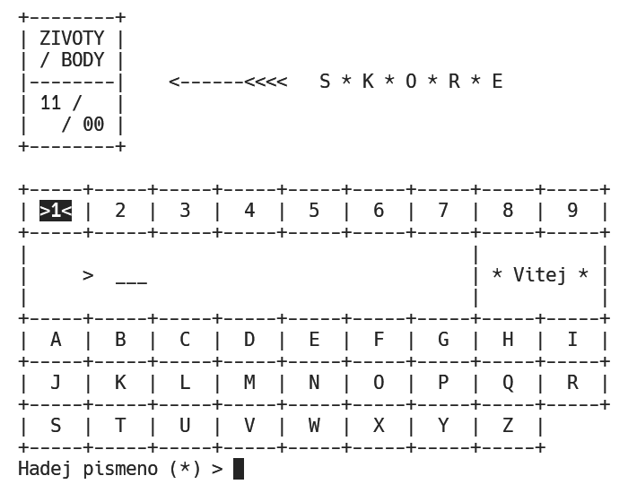
</figure>

<figure>
  <figcaption>MS-DOS&nbsp;&ndash;&nbsp;slovo uhodnuto:</figcaption>
  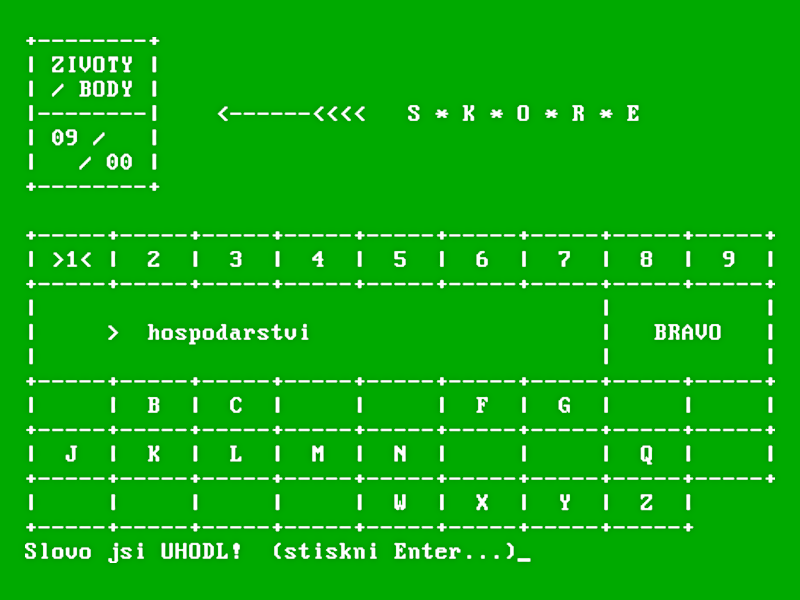
</figure>

<figure>
  <figcaption>MS-DOS&nbsp;&ndash;&nbsp;tři a méně žitovů:</figcaption>
  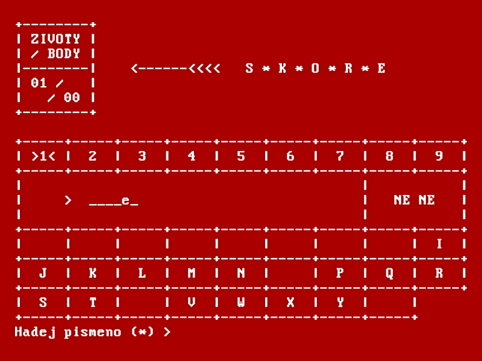
</figure>

<figure>
  <figcaption>MS-DOS&nbsp;&ndash;&nbsp;slovo neuhodnuto:</figcaption>
  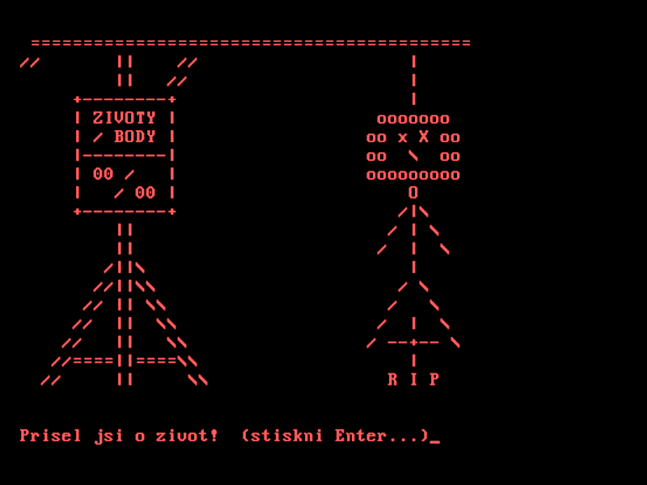
</figure>

<figure>
  <figcaption>MS-DOS&nbsp;&ndash;&nbsp;obrazovka prohry:</figcaption>
  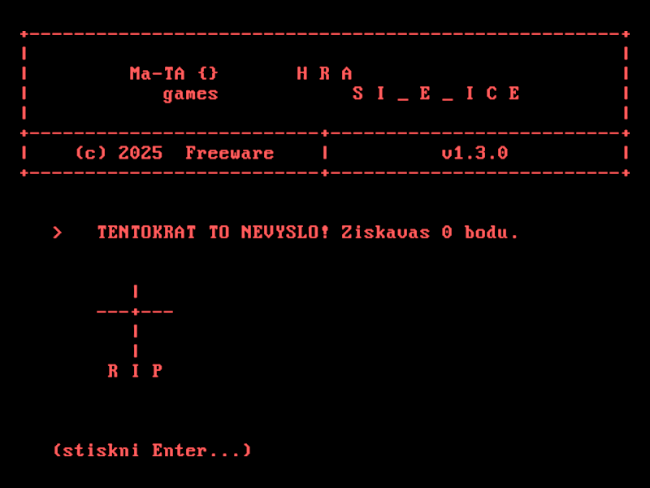
</figure>

<figure>
  <figcaption>MS-DOS&nbsp;&ndash;&nbsp;konec programu:</figcaption>
  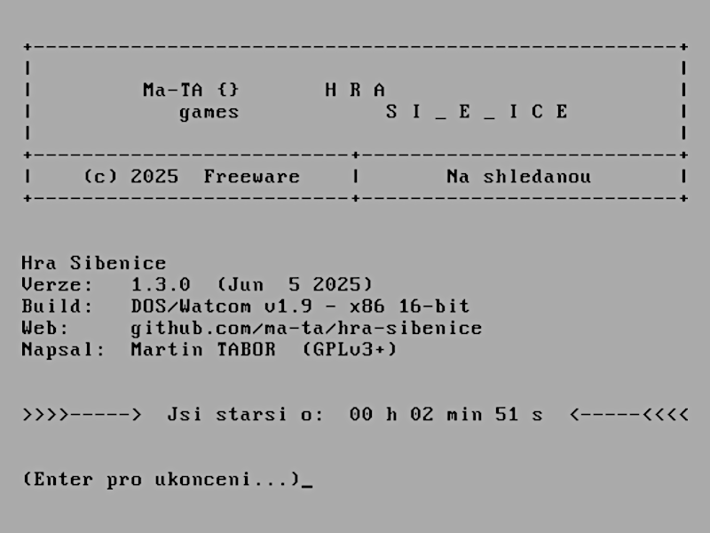
</figure>
