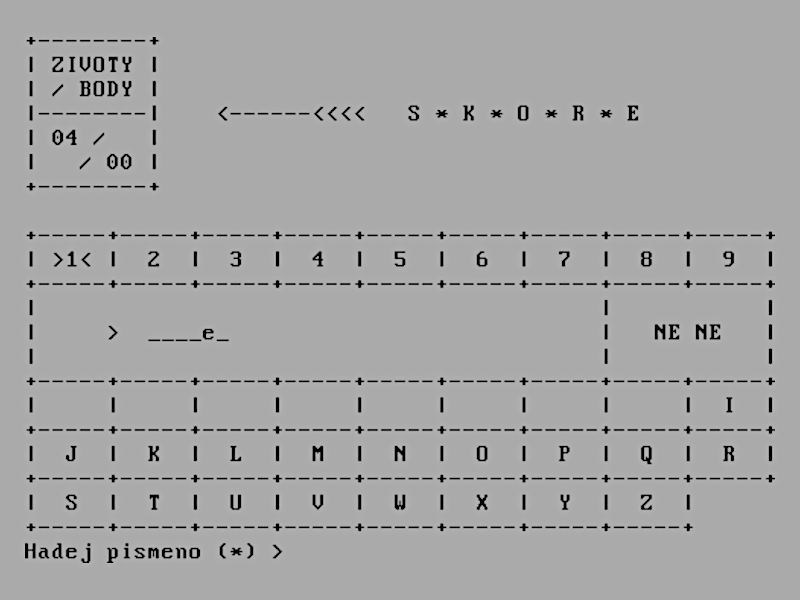
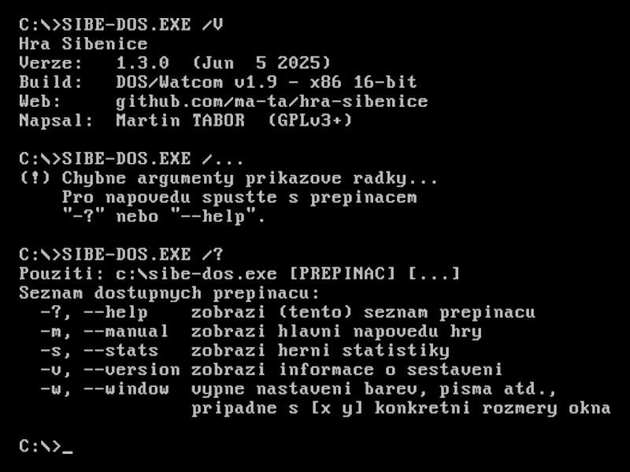

# Hra Š I _ E _ I C E

> Terminálová implementace známé slovní hry Šibenice (Oběšenec)

### Popis a stručné instrukce
Známá slovní hra (alias Oběšenec, Hangman) založená na hádání jednotlivých písmen tajného slova.
Program je napsán v jazyce ANSI C a pro jeho spuštění by neměly být potřeba žádné nestandardní knihovny.

- **[Základní instrukce k sestavení](how_make.txt)**
- [Nápověda ke hře](/res/napoveda.txt)
- [Známé chyby a nápady na další vývoj](/res/poznamky.txt)

### Binárky ke stažení

Rozbalte archiv ZIP a vyberte spustitelný soubor pro váš operační systém.

- **[All-in-one řešení (soubor ZIP)](//github.com/ma-ta/hra-sibenice/releases/download/v1.0.0/sibenice_1.0.0.zip)**
- [Složka s binárkami](bin/)

#### Pro systémy typu MS-DOS
V případě zobrazení hlášky *"Load error: no DPMI - Get csdpmi\*.zip"* umístěte soubor [CWSDPMI.EXE](/bin/CWSDPMI.EXE) do stejného adresáře jako spustitelný soubor hry. Více o problematice např. [zde](//en.wikipedia.org/wiki/CWSDPMI) nebo [zde](https://sandmann.dotster.com/cwsdpmi/).

#### Testované platformy:
- MS Windows *(překladač MSVC)*:
  - Windows 10/11
- DOS *(překladač DJGPP)*:
  - FreeDOS 1.3
  - DOSBox 0.74-3
  - DOSBox-X 2024.03.01
  - MS-DOS 6.22
- GNU/Linux *(překladač GNU GCC)*:
  - Ubuntu 22.04 LTS (via WSL)
  - Fedora 39

### Snímky obrazovky

- [Všechny dostupné screenshoty zde](/res/screenshots)

Hlavní menu:

Obrazovka hry:

Herní statistiky:

Obrazovka hry (DOS – 25x80 znaků):

Informace o verzi (DOS):

